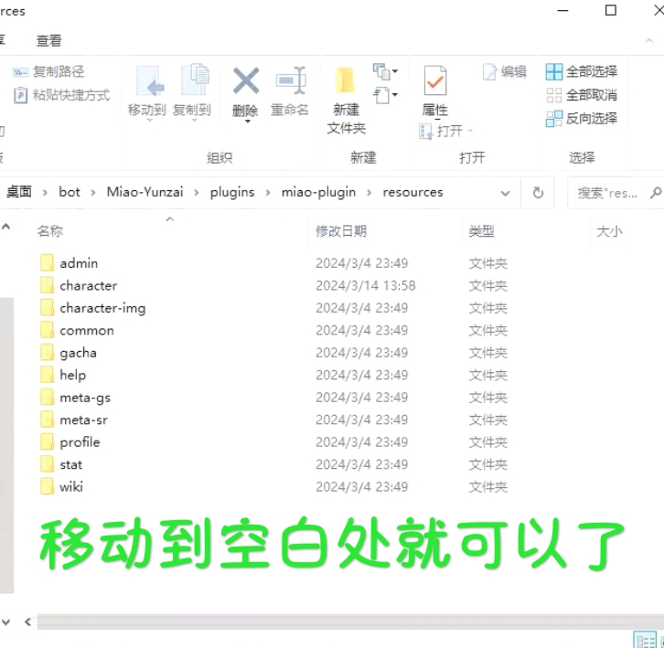

# miao-plugin 扩展面板

## 给miao-plugin在原有的基础上增加miao-plugin还未有的角色数据及伤害计算
#####  _当前版本:`sr2.2v4` `gs暂无`_ 
##### 由于我懒,所以sr角色的data中cv及所属是随便填的,问题不大的！
##### 主要还是个人用的,不建议刚用云崽的人使用

## 访问量：        
<br> <br>

#  **使用说明** 
下载后将文件移动到下方位置并替换
```
plugins\miao-plugin\resources
```

#  **随便找个地方输入** 
```
git clone https://gitee.com/euiko/Panel.git
```

#  **支持什么内容** 
`星铁各命途的主角 √`
`测试角色面板数据 √`
`测试圣遗物及专武数据 √`

# 若有问题或者建议就提交  `Issues` 
##### 注意:使用后之后`#喵喵更新`可能会报冲突
##### 删除冲突文件再`#喵喵更新`就可以了
##### 但是会导致无法使用本数据包的内容
##### 所以等喵喵更新了后你先按上面的先更新喵喵的
##### 再等我同步更新,到时候再直接替换就可以了！
##### 看主角面板直接把主角摆展示柜等5分钟左右再`*更新面板`就可以了

# 使用前提

* [Miao-Yunzai](https://github.com/yoimiya-kokomi/Miao-Yunzai) : 喵版Yunzai [Gitee](https://gitee.com/yoimiya-kokomi/Miao-Yunzai)
  / [Github](https://github.com/yoimiya-kokomi/Miao-Yunzai)
* [miao-plugin](https://github.com/yoimiya-kokomi/miao-plugin) : 喵喵插件 [Gitee](https://gitee.com/yoimiya-kokomi/miao-plugin)
  / [Github](https://github.com/yoimiya-kokomi/miao-plugin)